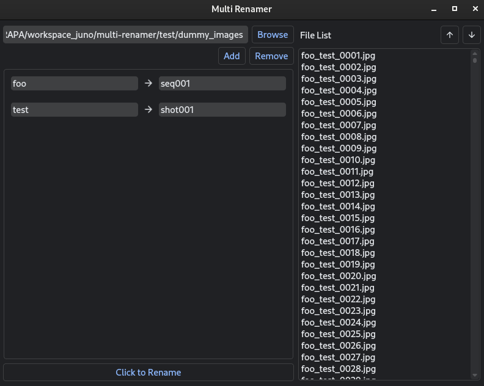

# Multi Renamer

Multi Renamer is a PySide2-based GUI application designed to simplify the batch renaming of files within a specified directory. This tool allows users to define renaming rules and apply them efficiently to multiple files, making the process of renaming large sets of files quick and easy.

## Table of Contents
- [Features](#features)
- [Installation](#installation)
- [Usage](#usage)
- [How to use](#how-to-use)
- [Code Structure](#code-structure)
- [License](#license)
- [Contributing](#contributing)

## Features

- **Browse Directory:** Select a directory to list all files within it.
- **Add Rename Rules:** Define multiple renaming rules where you specify the text to be replaced and the replacement text.
- **Remove Rules:** Remove the last added renaming rule.
- **Sort Files:** Sort the listed files in ascending or descending order.
- **Batch Rename:** Apply the defined renaming rules to all files in the directory with a single click.
- **Dark Theme:** The application uses a dark theme for a sleek and modern look.

<center>



</center>


## Installation

To use Multi Renamer, you need to have Python installed on your system along with the following packages:

- PySide2
- qdarktheme

You can install these dependencies using `pip`:

```bash
pip install PySide2 qdarktheme
```
Clone the repository and navigate to the project directory:

```bash
git clone https://github.com/junopark00/multi-renamer.git
cd multi-renamer
```

## Usage
Run the application by executing the main script:

```bash
python ./renamer.py
```

## How to Use
- Browse Directory:

  Click on the "Browse" button to select the directory containing the files you want to rename.

  The selected path will be displayed in the text field, and the files will be listed on the right side.

- Add Rename Rules:

  Click on the "Add" button to add a new renaming rule.
  Fill in the text to be replaced and the replacement text in the two text 
  fields that appear.

- Remove Rename Rules:

  Click on the "Remove" button to remove the last added renaming rule.

- Sort Files:

  Use the up and down arrow buttons to sort the listed files in ascending or descending order.

- Batch Rename:

  Once all renaming rules are defined, click on the "Click to Rename" button to apply the rules to all files in the directory.
  A success message will be displayed upon completion, and the file list will be updated.


## Code Structure
`renamer.py`: The main script to run the application.

`renamer_ui.py`: Contains the RenamerUI class for setting up the user interface.

`MultiRenamer`: Inherits from RenamerUI and implements the renaming functionality.

## License
This project is licensed under the MIT License. See the LICENSE file for details.

## Contributing
Welcome contributions to multi-renamer.

To contribute:

Fork the repository.
Create a new branch (git checkout -b feature/your-feature-name).
Make your changes.
Commit your changes (git commit -m 'Add some feature').
Push to the branch (git push origin feature/your-feature-name).
Open a pull request.Contributions are welcome! Please open an issue or submit a pull request on GitHub.